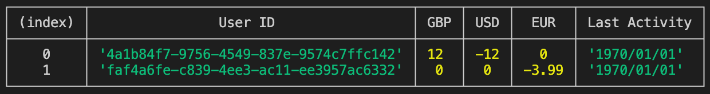

# Typescript CLI project

## Introduction

This project is a CLI tool built with typescript to ingest a JSON file containing a list of credit/debit card transactions for a group of users, process the transactions and compute the final balances for each user.

## Install

- Clone the repo and run the command:

```bash
yarn install
```

## Usage

```bash
npm run build
```

This command will create an executable file in /bin/src directory.

After that we need to create a symlink between the command and the executable. We have specified the bin property in package.json and pointed the command to the bin/src/index.js

Create a symlink by running the following command at the project root:

```bash
yarn link
```

You can then run

```bash
my-script ./transactions.json
```

and see the following output printed in the console


## Testing

The main processing logic as well as the utility functions are covered by tests.

You can run them by executing the command:

```bash
npm run test
```

## Libraries used

- Commander (Helpful tool to parse arguments and display usage errors)
- Chalk (Colorize output)
- fs (read json data)
- moment (format date)
- jest (testing)
